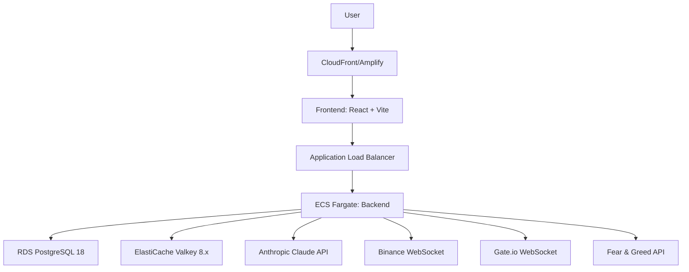

# Sage.ai System Architecture Overview

> Version: 2.0
> Last Updated: 2026-01-23
> Repository Structure: Multi-repository

---

## Vision: AI Quant Team

Sage.ai는 단순한 챗봇이 아닌, **AI로 구성된 퀀트 팀**을 구축하는 프로젝트입니다.

월스트리트의 퀀트 팀처럼 여러 전문 애널리스트들이 협업하여 분석하고, 그 결과를 조합해 투자 인사이트를 제공합니다.

```
┌─────────────────────────────────────────────────────────────────┐
│                        AI Quant Team                             │
├─────────────────────────────────────────────────────────────────┤
│                                                                  │
│  ┌──────────┐  ┌──────────┐  ┌──────────┐  ┌──────────┐        │
│  │  Price   │  │Sentiment │  │  Trend   │  │ Onchain  │  ...   │
│  │ Analyst  │  │ Analyst  │  │ Analyst  │  │ Analyst  │        │
│  └────┬─────┘  └────┬─────┘  └────┬─────┘  └────┬─────┘        │
│       │             │             │             │               │
│       └─────────────┴──────┬──────┴─────────────┘               │
│                            ↓                                     │
│                   ┌─────────────────┐                           │
│                   │  Risk Manager   │                           │
│                   └────────┬────────┘                           │
│                            ↓                                     │
│            ┌───────────────┼───────────────┐                    │
│            ↓               ↓               ↓                    │
│       ┌─────────┐    ┌─────────┐    ┌─────────┐                │
│       │ Chatbot │    │ Report  │    │ Signal  │                │
│       │(Wallet  │    │ Writer  │    │Generator│                │
│       │Buffett) │    │         │    │         │                │
│       └─────────┘    └─────────┘    └─────────┘                │
│                                                                  │
└─────────────────────────────────────────────────────────────────┘
```

### Design Principles

1. **모듈형 설계**: 각 분석 모듈은 독립적이며, 필요에 따라 조합 가능
2. **데이터 주입**: 모듈은 외부에서 데이터를 주입받아 처리 (강결합 방지)
3. **설명 가능성**: 규칙 기반 분석으로 결과에 대한 근거 제공
4. **다양한 Output**: 같은 분석 결과를 챗봇/리포트/전략 등 다양한 형태로 활용

### B2B + B2C 전략

- **B2C (현재)**: Wallet Buffett 챗봇으로 개인 투자자에게 서비스
- **B2B (확장)**: 분석 모듈을 API/리포트 형태로 기업에 제공

---

## Modular Architecture

### Module Categories

```
┌─────────────────────────────────────────────────────────────────┐
│                       Data Collectors                            │
│  (외부 데이터 수집 - 모듈에 주입)                                 │
├──────────────┬──────────────┬──────────────┬────────────────────┤
│ Price        │ Sentiment    │ Onchain      │ Macro              │
│ Collector    │ Collector    │ Collector    │ Collector          │
│ (Binance)    │ (F&G, Social)│ (Whale, Flow)│ (Rates, DXY)       │
└──────────────┴──────────────┴──────────────┴────────────────────┘
                              ↓ 데이터 주입
┌─────────────────────────────────────────────────────────────────┐
│                      Analysis Modules                            │
│  (규칙 기반 분석 - 독립적, 조합 가능)                             │
├──────────────┬──────────────┬──────────────┬────────────────────┤
│ Price        │ Sentiment    │ Trend        │ Volatility         │
│ Analyzer     │ Analyzer     │ Analyzer     │ Analyzer           │
│              │              │              │                    │
│ - 가격 해석  │ - F&G 해석   │ - 추세 판단  │ - 변동성 분석      │
│ - 지지/저항  │ - 과열/침체  │ - 모멘텀     │ - 리스크 측정      │
└──────────────┴──────────────┴──────────────┴────────────────────┘
                              ↓ 분석 결과
┌─────────────────────────────────────────────────────────────────┐
│                      Output Formatters                          │
│  (분석 결과를 용도에 맞게 변환)                                        │
├──────────────┬──────────────┬──────────────┬────────────────────┤
│ Persona      │ Report       │ Signal       │ API                │
│ Formatter    │ Formatter    │ Generator    │ Response           │
│ (챗봇)        │ (리포트)       │ (전략)        │ (B2B)              │
└──────────────┴──────────────┴──────────────┴────────────────────┘
```

### Module Interface

모든 분석 모듈은 표준 인터페이스를 따릅니다:

```typescript
interface AnalysisModule<TInput, TOutput> {
  name: string;
  analyze(input: TInput): Promise<TOutput>;
}

// Example: SentimentAnalyzer
interface SentimentInput {
  fearGreedValue: number;
}

interface SentimentOutput {
  level: 'extreme_fear' | 'fear' | 'neutral' | 'greed' | 'extreme_greed';
  signal: 'contrarian_buy' | 'hold' | 'contrarian_sell';
  confidence: number;
  reasoning: string;
}
```

### Pipeline Composition

모듈들을 조합하여 파이프라인을 구성합니다:

```typescript
// 챗봇 파이프라인
const chatPipeline = new Pipeline([
  priceAnalyzer,
  sentimentAnalyzer,
  personaFormatter  // Wallet Buffett 스타일
]);

// 리포트 파이프라인 (추후)
const reportPipeline = new Pipeline([
  priceAnalyzer,
  sentimentAnalyzer,
  trendAnalyzer,
  reportFormatter
]);

// 전략 파이프라인 (추후)
const signalPipeline = new Pipeline([
  priceAnalyzer,
  sentimentAnalyzer,
  volatilityAnalyzer,
  signalGenerator
]);
```

---

## Repository Structure

Sage.ai는 4개의 독립 레포지토리로 구성됩니다:

### 1. sage-docs (Documentation)
- **Purpose**: Single Source of Truth for all documentation
- **Repository**: `https://github.com/5010-dev/sage-docs`
- **Contents**:
  - Technical specifications (backend, frontend, infrastructure)
  - Business and product documents
  - Architecture documentation
  - GitHub Wiki synchronization

### 2. sage-front (Frontend Application)
- **Purpose**: React-based web application
- **Repository**: `https://github.com/5010-dev/sage-front`
- **Tech Stack**: React 18.3, Vite 5, TypeScript, Zustand, TanStack Query
- **Deployment**: AWS Amplify
- **Key Features**:
  - Chat interface with SSE streaming
  - Shadow portfolio management
  - Market data visualization

### 3. sage-back (Backend API)
- **Purpose**: Nest.js-based API server
- **Repository**: `https://github.com/5010-dev/sage-back`
- **Tech Stack**: Nest.js 11.x, Prisma 5.19.1, PostgreSQL 18, Valkey 8.x
- **Deployment**: ECS Fargate
- **Key Features**:
  - Modular Analysis Pipeline
  - SSE streaming endpoints
  - Real-time market data integration

### 4. sage-infra (Infrastructure)
- **Purpose**: Infrastructure as Code
- **Repository**: `https://github.com/5010-dev/sage-infra`
- **Tech Stack**: Pulumi 3.x (TypeScript)
- **Resources**: ECS Fargate, RDS, ElastiCache, ALB, Amplify

---

## System Architecture Diagram



---

## Agent Pipeline Architecture

기존 Agent Pipeline을 모듈형 구조로 확장합니다:

```
┌─────────────────────────────────────────────────────────────────┐
│                        Agent Pipeline                            │
├─────────────────────────────────────────────────────────────────┤
│                                                                  │
│  ┌──────────────┐                                               │
│  │   Manager    │  의도 분석 + 필요한 모듈 결정                  │
│  │    Agent     │  (LLM: Haiku 4)                               │
│  └──────┬───────┘                                               │
│         │                                                        │
│         ↓                                                        │
│  ┌──────────────────────────────────────────────────────────┐   │
│  │              Analysis Modules (선택적 실행)               │   │
│  │  ┌──────────┐ ┌──────────┐ ┌──────────┐ ┌──────────┐    │   │
│  │  │  Price   │ │Sentiment │ │Portfolio │ │  Trade   │    │   │
│  │  │ Analyzer │ │ Analyzer │ │ Analyzer │ │ Executor │    │   │
│  │  └──────────┘ └──────────┘ └──────────┘ └──────────┘    │   │
│  └──────────────────────────────────────────────────────────┘   │
│         │                                                        │
│         ↓                                                        │
│  ┌──────────────┐                                               │
│  │   Persona    │  분석 결과 → 페르소나 스타일 변환              │
│  │    Agent     │  (LLM: Sonnet 4)                              │
│  └──────┬───────┘                                               │
│         │                                                        │
│         ↓                                                        │
│  ┌──────────────┐                                               │
│  │    Risk      │  응답 검증 (환각, 직접 신호, 편향)             │
│  │    Agent     │  (LLM: Haiku 4)                               │
│  └──────────────┘                                               │
│                                                                  │
└─────────────────────────────────────────────────────────────────┘
```

### Agent Roles (Updated)

| Agent | 역할 | LLM | 변경사항 |
|-------|------|-----|----------|
| **Manager** | 의도 분석, 모듈 선택 | Haiku 4 | 유지 |
| **Analyzers** | 전문 분야별 분석 | 규칙 기반 | **신규 (모듈화)** |
| **Persona** | 분석 결과를 스타일 변환 | Sonnet 4 | 역할 축소 (표현만) |
| **Risk** | 응답 검증 | Haiku 4 | 유지 |

### Key Change: 분석 로직 분리

**기존**: Persona Agent가 분석 + 해석 + 표현을 모두 담당 (LLM 블랙박스)

**변경**:
- Analyzer 모듈이 규칙 기반으로 분석 (설명 가능)
- Persona Agent는 분석 결과를 페르소나 스타일로 "표현"만 담당

---

## Data Flow

### 1. User Message Flow (Updated)
```
User Input
  → Frontend (React)
  → POST /api/chats/:id/messages
  → Backend (Nest.js)
  → Manager Agent (의도 분석)
  → Analysis Modules (필요한 모듈만 실행)
      ├─ PriceAnalyzer (가격 분석)
      ├─ SentimentAnalyzer (F&G 분석)
      └─ PortfolioAnalyzer (포트폴리오 분석)
  → Persona Agent (스타일 변환)
  → Risk Agent (검증)
  → SSE Stream Response
  → Frontend Display
```

### 2. Market Data Flow
```
Binance WebSocket
  → Backend MarketService
  → Valkey Cache (5-min TTL)
  → API Response / Analysis Modules 주입
  → Frontend Display
```

### 3. Proactive Alert Flow
```
Price Change Detection
  → BullMQ Job
  → Discord Webhook
  → PWA Push Notification
  → User Action
```

---

## Module Roadmap

### Phase 1: MVP (현재)
| 모듈 | 상태 | 설명 |
|------|------|------|
| PriceAnalyzer | 구현 예정 | 가격 해석, 변동률 분석 |
| SentimentAnalyzer | 구현 예정 | F&G 해석, 시장 심리 분석 |
| PortfolioAnalyzer | 구현 예정 | 포트폴리오 성과 분석 |
| PersonaFormatter | 구현됨 | Wallet Buffett 스타일 변환 |

### Phase 2: 확장
| 모듈 | 설명 |
|------|------|
| TrendAnalyzer | 추세/모멘텀 분석 |
| VolatilityAnalyzer | 변동성/리스크 분석 |
| ReportFormatter | 리포트 형식 출력 |

### Phase 3: 고도화
| 모듈 | 설명 |
|------|------|
| OnchainAnalyzer | 고래 움직임, 거래소 유출입 |
| MacroAnalyzer | 금리, DXY 등 매크로 지표 |
| SignalGenerator | 자동 매매 시그널 생성 |

### Phase 4: ML 통합
| 모듈 | 설명 |
|------|------|
| MLPredictor | 머신러닝 기반 예측 |
| ExplainabilityModule | ML 결과에 대한 설명 생성 |

---

## Tech Stack Summary

### Frontend
- **Framework**: React 18.3 + Vite 5
- **State**: Zustand 4.x (client), TanStack Query 5.x (server)
- **Styling**: Tailwind CSS 3.x + shadcn/ui
- **Real-time**: SSE client (EventSource API)
- **PWA**: Vite PWA Plugin

### Backend
- **Framework**: Nest.js 11.x
- **ORM**: Prisma 5.19.1
- **Database**: PostgreSQL 18
- **Cache**: Valkey 8.x
- **Queue**: BullMQ 5.x
- **AI**: @anthropic-ai/sdk (+ Ollama for dev)
- **Auth**: Google OAuth + express-session

### Infrastructure
- **IaC**: Pulumi 3.x (TypeScript)
- **Compute**: AWS ECS Fargate
- **Database**: AWS RDS PostgreSQL 18
- **Cache**: AWS ElastiCache Valkey 8.x
- **CDN**: AWS Amplify (Frontend), CloudFront
- **Load Balancer**: AWS ALB
- **Monitoring**: Sentry + CloudWatch

---

## Performance Targets

| Metric | Target | Measurement |
|--------|--------|-------------|
| SSE First Token | < 2s | Time from POST to first token |
| Context Load | < 0.5s | 20 messages from PostgreSQL |
| API Response | < 200ms (P95) | REST endpoint latency |
| Cache Hit Rate | > 80% | Valkey hit/miss ratio |
| Hallucination Rate | < 1% | Risk Agent rejection rate |

---

## Security Architecture

### Authentication
- **Provider**: Google OAuth
- **Session**: HTTP-only cookies with express-session
- **Refresh**: Automatic session refresh

### Authorization
- User can only access their own chats and portfolio
- Admin endpoints require admin role

### Data Protection
- **Encryption at Rest**: RDS encryption enabled
- **Encryption in Transit**: TLS 1.2+ only
- **Secrets**: AWS Secrets Manager
- **CORS**: Whitelist app.sage.ai only

---

## Scaling Strategy

### Horizontal Scaling
- **Frontend**: CloudFront CDN (global distribution)
- **Backend**: ECS Auto Scaling (2 → 10 tasks)
- **Database**: RDS read replicas (future)
- **Cache**: ElastiCache cluster mode (future)

### Vertical Scaling
- **ECS Task**: 0.5 vCPU, 1GB RAM (MVP) → adjustable
- **RDS Instance**: db.t4g.micro (MVP) → db.r6g.large (production)

---

## Monitoring & Alerting

### Metrics
- **Application**: Sentry (errors, performance)
- **Infrastructure**: CloudWatch (CPU, memory, network)
- **Custom**: SSE latency, Agent Pipeline duration, Module execution time

### Alerts
- **Discord Webhook**:
  - SSE first token > 5s
  - Error rate > 1%
  - Database connection failures
- **Slack Integration**: Future

---

## Documentation Links

- [Backend Specification](../specs/backend-spec.md)
- [Frontend Specification](../specs/frontend-spec.md)
- [Infrastructure Specification](../specs/infrastructure-spec.md)
- [Product Specification](../product/product-spec.md)
- [MVP Definition](../business/mvp-definition.md)

---

## Repository Links

- **Documentation**: [sage-docs](https://github.com/5010-dev/sage-docs)
- **Frontend**: [sage-front](https://github.com/5010-dev/sage-front)
- **Backend**: [sage-back](https://github.com/5010-dev/sage-back)
- **Infrastructure**: [sage-infra](https://github.com/5010-dev/sage-infra)

---

**Last Updated**: 2026-01-23
**Version**: 2.0

### Changelog

**v2.0 (2026-01-23)**:
- AI Quant Team 비전 추가
- 모듈형 아키텍처 설계 문서화
- Analysis Modules 개념 도입
- Agent Pipeline 역할 재정의 (Persona: 표현만 담당)
- 모듈 로드맵 추가 (Phase 1-4)
- B2B + B2C 전략 명시

**v1.0 (2026-01-05)**:
- 초기 시스템 아키텍처 문서
